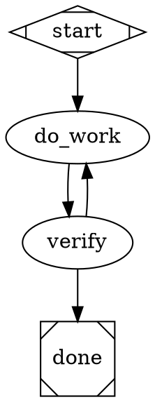

All research done. Here is the report.

---

# Amplifier's Long-Running / Hill-Climbing Processes

Research based on shallow clones of three Microsoft Amplifier bundles (2026-07-16): `amplifier-bundle-evaluation`, `amplifier-bundle-attractor`, `amplifier-bundle-resolve`. These three form a layered story: **attractor** is the loop engine (declarative DOT-graph pipelines with gates, retries, and convergence loops), **evaluation** is the measurement harness (scored, resumable multi-trial batches in sandboxed Digital Twin Universes), and **resolve** is the autonomous-code-generation platform that runs attractor pipelines (and other strategies) as long-lived containerized "instances."

---

## 1. amplifier-bundle-evaluation — the measurement loop

### What it is / when to reach for it
"A one-stop-shop for evaluating AI agents, bundles, and recipes across the Amplifier ecosystem." Two halves:

1. An **`evaluation` mode** (`modes/evaluation.md`, delivered via `amplifier-bundle-modes`) — expert guidance the agent loads to help a user *design* evaluations. Users invoke it conversationally:
   - `/evaluation I have changes to an Amplifier bundle I would like to evaluate the impact of. Can you help me measure it?`
   - `/evaluation I built a memory system and want to know if it improves my agent`
2. A **Python harness package** (`amplifier_evaluation`) + CLI (`amplifier-evaluation`) for *running* pre-defined tasks against agents inside a **Digital Twin Universe (DTU)** — an Incus-container sandbox launched from a YAML profile.

Users reach for it to: measure a new bundle/feature (1–3 custom scenarios), benchmark a general agent (the shipped 27-task `amplifier-benchmark/`), A/B "before vs after" comparisons that vary exactly one dimension, or run public benchmarks (HLE, SWE-bench) when external comparability is needed.

### Installation / invocation
```bash
# The mode (composed onto every session with --app)
amplifier bundle add "git+https://github.com/microsoft/amplifier-bundle-evaluation@main#subdirectory=behaviors/evaluation.yaml" --app
amplifier bundle add "git+https://github.com/microsoft/amplifier-bundle-modes@main#subdirectory=behaviors/modes.yaml" --app

# The CLI harness
uv tool install git+https://github.com/microsoft/amplifier-bundle-evaluation@main

# Run the benchmark over every (agent, task) permutation
amplifier-evaluation run --agents-dir amplifier-benchmark/agents --tasks-dir amplifier-benchmark/tasks

# Full option form
amplifier-evaluation run \
  --agents-dir amplifier-benchmark/agents --tasks-dir amplifier-benchmark/tasks \
  --output-dir results --agent amplifier-foundation --task cpsc_recall_monitor \
  --max-parallel 2 --trials-per-pair 1
# also: --pair agent:task (repeatable), --launch-var KEY=VALUE, --run-id <id>, --dry-run
# also runnable as: python -m amplifier_evaluation run
```

### The evaluation loop (per trial)
The harness (`src/amplifier_evaluation/harness/`) orchestrates four AI pieces — `AIUser` (a Foundation session role-playing a user, driving the agent CLI via `amplifier-digital-twin exec`, ending with a `conclude` tool call), `Extractor` (agent that pulls deliverables + session logs out of the DTU onto the host, submitting a structured manifest), `Grader` (agent that audits the DTU against a rubric and submits scores via a dynamically-schema'd `submit_rubric` tool, max 2 validation retries), and the scheduler. Deterministic per-trial state machine:

```
pending -> launching -> installing -> seeding -> running_agent -> extracting -> grading -> cleaning_up -> completed | failed | cancelled
```

Key loop properties (from `context/harness/harness_modules.md`):
- **Resumable ledger**: every stage transition atomically writes `trials/<id>/state.json` (tempfile + rename). "A crashed harness can be re-run and resume"; terminal trials are skipped on re-run.
- **Course-correction of multi-day runs**: an operator (human or agent) edits `state.json`: `cancel_requested: true` (stop at next stage boundary, destroy DTU) or `retry_requested: true` (terminal trial resets to `pending` on next invocation).
- **Isolation of failures**: extractor/grader failure inside a trial does not fail the trial; the scheduler converts any escaped exception into a synthetic `failed` result "so a multi-day batch survives individual trial crashes."
- **Parallelism**: plain `asyncio.Semaphore` (`--max-parallel`). The mode advises running "at least 4 in parallel" and polling progress rather than long bash timeouts.
- **Timeout**: `meta.yaml.timeout` (e.g. `1800`) enforced around the AI User via `asyncio.wait_for`; DTU always destroyed in `finally`.

### Task / agent file formats
A task = directory `tasks/<id>/` with `meta.yaml` (name, difficulty, categories, timeout), `task.yaml` (plain instructions), `profile.yaml` (DTU profile: base image, `passthrough.services` API-key forwarding, `provision.setup_cmds`, `readiness` checks), `grader.yaml`, optional `grader-data/` (answer keys mounted into the DTU only at grading time), optional `workspace/` (seeded files). Real grader excerpt (`amplifier-benchmark/tasks/cpsc_recall_monitor/grader.yaml`):

```yaml
evaluations:
  - name: end_to_end
    weight: 1.0
    steps: |
      1. Find and read the README to understand how to run the CPSC recall tool.
      ...
      3. Run the tool with "December 2024" ... If the tool fails ... assign a score of 0.
    rubric:
      tool_runs_successfully: {points: 20, description: Does the tool run without errors ...}
      recall_dates_correct_month: {points: 10, description: Are the recall dates actually from the requested month ...}
```
Final score = weighted sum of per-evaluation scores.

An agent = `agents/<id>/` with `meta.yaml`, `install.yaml` (`requires.env` + `setup_cmds` run via `bash -lc` in the DTU — e.g. `uv tool install git+https://github.com/microsoft/amplifier`, `amplifier bundle add ... --app`, write `/root/.amplifier/settings.yaml`), `invocation.md` (how the AI User talks to the CLI), `data.yaml` (where session transcripts live, e.g. `/root/.amplifier/projects/-workspace/sessions/{session_id}` with `transcript.jsonl`, `metadata.json`, `events.jsonl` — treated as a *hint*; the Extractor walks the tree if paths drift).

### Artifacts produced (one run)
```
<output_dir>/
  run.json                 plan: agents, tasks, selection, started_at
  summary.json             final counts + per-trial summaries
  trials/<trial-id>/
    state.json             state machine + history + per-stage summaries
    trial.log, launch_profile.yaml, install.log, instructions.txt
    ai_user.json           AI User result (conclude verdict, session id)
    extraction/            extraction_report.md + manifest.json + pulled artifacts
    grader/<eval>/         initial_report.md + rubric.json per evaluation
    grader/grader_result.json   weighted overall + per-evaluation scores
```
Output must never be committed (contains keys/prompts/paths); default location `.amplifier/evaluation/<project>/<sortable-datetime>/`. Dashboards: the `stories:evaluation-visualizer` agent (from amplifier-bundle-stories), a project `visualize.py`, or ad-hoc HTML.

### Philosophy (verbatim signals from `modes/evaluation.md`)
"Less is More" (few high-signal scenarios); "Lean into using agents rather than brittle code" (hence the AI Grader/Extractor); "Evaluations Are Lengthy, and That's OK" (hours; confirm cost only for large runs); overfitting warnings (hold scenarios back, refresh tasks); vary exactly one dimension in A/B runs; bake heavyweight DTU profiles into golden Incus images for reuse (`context/harness/golden_image_caching.md`). Worked examples in `examples/` (01 explorer-removal A/B, 02 HLE, 03 SWE-bench Multimodal, 04 foundation-vs-dev 12-trial demo with HTML report); the bundle even dogfoods itself via `.amplifier/evaluations/run.sh`, which snapshots the working tree into a Gitea mirror as `main` and dispatches `python3 -m amplifier_evaluation run ... --launch-var GITEA_URL=... --launch-var GITEA_TOKEN=...`.

---

## 2. amplifier-bundle-attractor — the convergence / hill-climbing engine

### What an "attractor" is here
An implementation of the **StrongDM "attractor" nlspec** (github.com/strongdm/attractor): "a non-interactive coding agent structured as a graph of phases, sufficient for use in a Software Factory." Concretely: a **DOT-based pipeline runner** — multi-stage AI workflows declared as Graphviz digraphs where node shapes determine behavior (`Mdiamond` start, `Msquare` exit, `box` LLM agent node, `component`/`tripleoctagon` parallel fan-out/in, `hexagon` human gate, `parallelogram` external tool, `house` manager/supervisor loop, `diamond` decision, `folder` nested child pipeline). The engine (`modules/loop-pipeline`) walks the graph; each LLM node spawns a **loop-agent** sub-session (agentic tool loop). The "attractor" quality is that goal gates, retry targets, and convergence loops keep pulling execution back toward the goal state until gates are satisfied or bounds are exhausted.

### How a user starts one
Four entry paths:

1. **Bundle config** (primary):
```yaml
# .amplifier/config.yaml
includes:
  - bundle: git+https://github.com/microsoft/amplifier-bundle-attractor@main#subdirectory=profiles/attractor-profile-anthropic
  - bundle: attractor:bundles/attractor-pipeline
session:
  orchestrator:
    config:
      dot_file: examples/pipelines/02-plan-implement-test.dot   # or dot_source: "digraph { ... }"
```
No pipeline-specific CLI flags; the goal lives in the DOT: `graph [goal="Add input validation to the login endpoint"]` (or via `params` for `$param` expansion).

2. **Conversationally** via `bundles/attractor-interactive` and the synchronous `run_pipeline` tool ("Run the plan-implement-test pipeline to add input validation..."). The tool takes `goal` (required) + `dot_file` or `dot_source` + `params`; heuristic in `context/pipeline-awareness.md`: 1–2 steps → no pipeline; 2–4 ordered steps → inline `dot_source`; complex branching/gates → full pipeline. A `attractor:attractor-expert` agent is available for design/debugging delegation.

3. **Standalone CLI** (`modules/pipeline-runner`, script name `attractor`):
```bash
attractor run pipeline.dot \
  --param goal="Fix the flaky test" \
  --param worklist=@path/to/checklist.md \   # @file reads file contents
  --provider anthropic --logs-root ./runs \
  --cwd . --on-human-gate fail|auto-approve
attractor doctor    # environment diagnostics
```

4. **Programmatically**: `DirectProviderBackend` (LLM-only) or full Amplifier session with `session.spawn` registered → `AmplifierBackend` (each node gets a tool-equipped child session). Falls back to simulation mode with neither.

Provider profiles: `attractor-profile-anthropic` (Claude Code conventions, 120s bash), `attractor-profile-openai` (codex-rs conventions, apply_patch v4a, 10s bash), `attractor-profile-gemini` (web tools). Multi-provider per-node routing via CSS-like `model_stylesheet` (`.planning { llm_model: o3; reasoning_effort: high }`, `#final_review { llm_model: claude-opus-... }`).

### The hill-climbing loop mechanics
**Routing** (`docs/ROUTING-REFERENCE.md`): each node's agent ends by calling `report_outcome(status, preferred_label, suggested_next_ids, context_updates, notes, failure_reason)`. `status` (`success|partial_success|retry|fail|skipped`) drives goal-gate/retry logic; `preferred_label` is the routing signal matched against edge `label`/`condition` expressions; `context_updates` merges into pipeline context (readable as `context.<key>` in later conditions). Edge conditions are `key=value` matches (e.g. `condition="outcome=success"`, `condition="context.tool.last_line=todo"`), selected by a deterministic five-step algorithm.

**Convergence primitives**:
- `goal_gate=true` — node must succeed for the pipeline to complete; `retry_target="plan"` jumps back on gate failure; `max_retries` / graph `default_max_retry` bound iterations; graph-level `retry_target`/`fallback_retry_target` handle exit-with-unsatisfied-gates. Hard engine ceiling: `PipelineEngine._MAX_GOAL_GATE_RETRIES = 50`.
- Canonical retry loop (`docs/DOT-SYNTAX.md`):

- **Loop convergence doctrine** (`docs/PIPELINE_DESIGN_PRINCIPLES.md` §3): "Loops require a deterministic exit predicate, a bounded iteration count, or both. LLM-judged convergence without a hard upper bound may never terminate." Pattern A — deterministic exit (a `parallelogram` node runs `python check_done.py && printf done || printf continue`; edges route on `context.tool.last_line`); Pattern B — bounded (`max_retries`); Pattern C — composite (LLM judges convergence, hard cap guarantees termination; LLM writes its verdict to a file, a tool node greps it and prints the routing sentinel — "Do not route directly on LLM token output").
- **Convergence factory** (`examples/patterns/convergence-factory.dot`) — the reusable hill-climb: `generate -> validate (tool) -> assess -> check -> {done | feedback -> generate}`. The assess node sets `preferred_label="converged"` or `"refine"`; the feedback node writes Pyramid-Summary refinement guidance to `.ai/feedback/` which the next `generate` iteration reads; the loop-back edge carries `loop_restart="true"`. Invoked as a nested pipeline from a parent `folder` node with `context.*` injection:
```dot
generate_utils [shape=folder, dot_file="convergence-factory.dot",
    context.artifact_goal="Create a Python file with function greet(name)...",
    context.artifact_path="utils.py",
    context.validation_criteria="File exists, contains def greet, ...",
    context.validation_command="python3 -c 'from utils import greet; assert ...'"]
```
- **Manager loop** (`shape=house`, `handlers/manager_loop.py`) — supervisor over a child subgraph, sprint-style: each cycle **observe** (run child), **evaluate** (`manager.stop_condition` condition expression; default guard = child success), **act** (inject steering context, wait `manager.poll_interval`). Stopping rules: guard satisfied, child succeeds, or `manager.max_cycles` (default 10) exhausted.

### Progress tracking & artifacts
- **`checkpoint.json`** written to `logs_root` after every node: `current_node`, `completed_nodes`, `context` snapshot, `node_retries`, `logs`, timestamp. Explicitly "an observability record, not a resume marker" — the engine always starts from the Start node.
- **Per-node log directories** under logs_root (e.g. `check_smells/output.txt`), edge-selection logs, pipeline event stream (spec §9.6) consumed by TUI/web frontends.
- **Observability hooks** (`hooks-pipeline-observability`): a StateAggregator plus a `StatusBarContributor` that injects a ≤7-line live pipeline status into the driving session's context; `hooks-pipeline-progress` reports stage progress; `tool-pipeline-status` and `tool-dashboard-query` (HTTP API) let an agent/UI query execution state.

### Resumability: graph-level, not engine-level
The blessed pattern (`examples/pipelines/12-graph-resume.md`): each stage writes a **durable artifact** (`.ai/smells.md`, `.ai/refactor-plan.md`, `.ai/snapshot.txt`, `.ai/STATE.json` with `{"tests_passed": bool}`); a cheap `parallelogram` guard node before each stage tests for the artifact and prints `done`/`todo`; edges route on `context.tool.last_line`. Crash recovery = just re-run; guards self-skip completed stages. Rewind = delete an artifact (`rm .ai/refactor-plan.md`) and re-run; `rm -rf .ai/` starts fresh. Rationale: engine-level checkpoint replay fails on edge-structure mismatch and graph drift; guard nodes re-evaluate real filesystem state every run — "No goto, no jump, no engine resume API."

Other stopping/safety rails: per-node `timeout` (`"30s"`, `"2m"`), human gates (`shape=hexagon`) with labeled choices (`review_gate -> done [label="[S] Ship it!"]`), fidelity modes (`full|compact|truncate|summary:high`) controlling context carryover, `thread_id` for shared context across loop iterations, loop-agent-level loop detection (`modules/loop-agent/loop_detection.py`).

---

## 3. amplifier-bundle-resolve — the autonomous-resolution platform

### What it resolves
The cross-cutting platform bundle for **Amplifier Resolve**, "an autonomous code generation platform with a pluggable resolver architecture" spanning 9 repos. Users submit work (a coding task, an issue, a pipeline goal); the platform "resolves" it end-to-end — planning, implementation, review, delivery — inside isolated containers, and can promote results to GitHub (edge-12 worktree→GitHub promotion flow). This bundle itself ships the cross-repo knowledge: 3 agents (`resolve-expert`, `stack-operator`, `resolver-author`), 3 skills (`resolve-dev-setup`, `resolve-runtime-ops`, `resolve-stack-management`), docs, and stack orchestration scripts.

### Loop structure
**Instance lifecycle** (the long-running unit of work): `POST /instances {resolver, input}` → backend validates against the resolver's A2UI schema → creates isolated worker container `resolve-{id}` (Incus) → injects the resolver package + coordination dir → launches the worker → the resolver's `run()` loop executes autonomously while the backend's **monitor loop** tails coordination files and pushes to the frontend. Status progression:

```
created → starting → running → completed
                        ↕ awaiting_input   ↕ paused   ↘ failed   ↘ cancelled
```
`paused` retains the container for later resume; `awaiting_input` is entered when the resolver requests human input mid-run (file-drop `input-requests/{request_id}.json` with an A2UI schema; host writes `{request_id}.response.json`).

**Container coordination ledger** (`/project/.resolve/`):
```
config.json        InstanceConfig serialized by the host
events.jsonl       append-only event log (SSE-streamed to browser)
state.json         atomic state snapshot (polled every 2–5s)
status.json        resolver-reported status checkpoint
data/              on-demand large data (graphs, LLM output; fetch-only)
input-requests/    resolver→human A2UI requests + host-written responses
messages/          consumer-initiated messages (001.json, ...)
```
Three-tier data strategy: events pushed (SSE), state polled, large data fetched on demand after a `{"type": "data_changed", "data": {"paths": ["graph.dot"]}}` event.

**Resolver protocol** (JSON-RPC over stdio; `docs/RESOLVER_GUIDE.md`): a resolver is a plugin with `manifest.json` (`command`, `supports_resume` — "Set true if your resolver can checkpoint and resume", `capabilities_required`, container setup, optional `viewport_bundle` UI) and a class implementing `get_instantiation_schema()`, `get_workspace_spec()`, and `async def run(self, *, resume: bool = False)` which `emit()`s events, may `request_input()`, and ends with `self.complete(result)` or `self.fail(error)` (exit 0 success / 1 fatal / 2 transient-retriable). Scaffold + local loop:
```bash
amplifier-resolve init-resolver hello-world
cd hello-world && uv pip install -e . amplifier-resolver-sdk
amplifier-resolve test-resolver . --params '{"task": "greetings"}' --auto-approve
amplifier-resolve resolver add git+https://github.com/you/hello-world
```

**Three shipped resolvers** (the three loop styles):
- **`dot-graph`** — runs Attractor DOT pipelines directly ("DOT-graph pipelines via attractor engine; each node is an independent Amplifier session" with full tools); its hook bridge writes an indexed `pipeline-status/` snapshot after each `pipeline:node_complete` event for the Mission Control viewport (live Graphviz-WASM graph). This is edge-10: attractor consumed as an upstream library (installed from `@main`, noted as unpinned).
- **`orchestrator`** — meta-orchestrator: plans dynamically at runtime, decomposes into sub-tasks, delegates to autonomous Amplifier workers in platform-managed sub-containers via tools `launch_worker`, `get_worker_result`, `send_to_worker`, `destroy_worker`, `ask_user`; workers launched in parallel and polled. "The graph structure is not predetermined."
- **`understudy`** — phase-driven: upfront intent alignment → dialogue → synthesis → approval → in-process asyncio workers → **independent verification** (LLM verifier for code inspection; a reality-check DTU for command-execution/browser journeys).

### How a user drives it
```bash
# Full stack, direct on host
uv tool install 'git+https://github.com/microsoft/amplifier-resolve@main' \
  --with 'amplifier-resolver-dot-graph @ git+https://github.com/microsoft/amplifier-resolver-dot-graph@main' \
  --with 'amplifier-resolver-orchestrator @ git+https://github.com/microsoft/amplifier-resolver-orchestrator@main' \
  --with 'amplifier-resolver-understudy @ git+https://github.com/microsoft/amplifier-resolver-understudy@main'
export ANTHROPIC_API_KEY=sk-... ; export GH_TOKEN=ghp_...
amplifier-resolve --port 10120
curl http://localhost:10120/api/health          # {"status": "ok"}
npx -y github:microsoft/amplifier-app-resolve#main serve --port 18174   # frontend

# Full stack in a DTU (containerized), from this bundle's scripts/
./scripts/resolve-stack.sh            # non-dev default
./scripts/resolve-stack.sh --dev      # bind mounts + live reload
./scripts/resolve-stack-destroy.sh    # teardown
./scripts/launch-dev-stack.sh --resolvers dot-graph   # DEV_RESOLVERS: mirror local resolver checkouts into a Gitea sidecar (port 10110) so fresh workers install local code

# Kick off a resolution (dispatch)
curl -X POST "http://localhost:$BACKEND_PORT/api/instances" \
  -H "Content-Type: application/json" \
  -d '{"pipeline": "optimize_bundle", ...}'
```
In an Amplifier session, the bundle's thin `context/resolve-awareness.md` mandates delegation: `resolve:resolve-expert` (architecture), `resolve:stack-operator` (deployment), `resolve:resolver-author` (plugin/DOT authoring) — heavy docs load only inside those agents.

### Live hill-climbing example: the repo's own issue triage
`.github/workflows/issue-triage.yml` runs an Attractor pipeline on every opened issue (via `microsoft/amplifier-app-actions` with `attractor_source: .github/amplifier/triage-review.dot`, `model: claude-sonnet-4-6`); `triage-continue.yml` lets trusted contributors re-run it with an `/investigate` comment. The pipeline (`triage-review.dot`) is a textbook adversarial climb:
- `investigate` (box, `timeout=7m`, thread `triage-thread` so context accumulates across cycles) does independent root-cause analysis and must emit only JSON: `{"status": "success", "context_updates": {"investigation_summary": "..."}}`.
- `quality_eval` (diamond, `goal_gate=true`, `retry_target="investigate"`, fresh `quality-thread` "for genuine independence", `reasoning_effort=high`) evaluates six FAIL criteria (proxy check, file:line specificity, ecosystem layer, sibling-module dimensionality, single recommendation, structure) and on FAIL returns `{"status":"fail", "context_updates": {"quality_feedback": "QUALITY GATE FAILED. Fix these issues:..."}}` — which the next `investigate` cycle is required to address (`$quality_feedback` is injected into its prompt).
- Only on gate success does `comment_draft` post to GitHub. Cycle bounds come from per-node timeouts + goal-gate retry accounting.

---

## 4. Common patterns across the three bundles

1. **File-based state ledgers as the source of truth.** Evaluation: per-trial `state.json` (atomic tempfile+rename) + `run.json`/`summary.json`; Attractor: `checkpoint.json` per node + `.ai/` stage artifacts + `STATE.json`; Resolve: `/project/.resolve/state.json` + append-only `events.jsonl` + `status.json`. In all three, external observers (humans, UIs, other agents) read the same files the system itself uses — "external observers see exactly the same data the built-in UI does."
2. **Append-only event streams + polling, not RPC.** `events.jsonl` appears in all three (Amplifier session logs, resolve coordination dir, context-intelligence hooks); progress UIs poll state files (evaluation `events.py` polls `state.json`; resolve monitor loop tails container files → SSE).
3. **Resumability by idempotent re-run, not engine replay.** Evaluation: re-invoke the harness; terminal trials skip, in-flight restart. Attractor: always run from Start; guard nodes self-skip on artifacts; rewind = delete a file. Resolve: `supports_resume` manifests + `run(resume=True)` + `paused` instances retaining containers.
4. **Course-correction hooks for multi-hour/multi-day runs.** Evaluation: write `cancel_requested`/`retry_requested` into `state.json`. Attractor: human gates (hexagon), manager-loop steering injection, `cancel_event`. Resolve: `input-requests/`, `messages/`, pause/resume, `/investigate` re-triggers.
5. **Convergence = LLM judgment bounded by deterministic caps.** Rubric graders with structured-tool validation retries (max 2); `goal_gate` + `max_retries` + engine cap 50; `manager.max_cycles` default 10; adversarial quality gates with explicit FAIL criteria feeding `$feedback` into the next iteration; the doctrine "the LLM is never the sole stop condition."
6. **Isolation per unit of work.** DTU/Incus containers per trial (evaluation), per instance + Gitea sidecars (resolve); one-dimension-at-a-time A/B discipline; Gitea mirrors of local working trees so agents-under-test compose code "as if deployed" without touching the user's repo.
7. **Agents over brittle code for fuzzy steps.** AI Grader/Extractor instead of deterministic parsers; DOT nodes as full agent sessions; delegate-to-expert agents (`attractor-expert`, `resolve-expert`) as context sinks.
8. **User-facing drive surface** (exact invocations): `/evaluation ...` mode; `amplifier-evaluation run ... --pair agent:task --max-parallel N --launch-var K=V`; `amplifier bundle add ... --app`; DOT via `session.orchestrator.config.dot_file`, the `run_pipeline` tool, or `attractor run pipeline.dot --param k=v`; `delegate to attractor:attractor-expert`; `amplifier-resolve --port 10120` + `POST /api/instances`; `resolve-stack.sh [--dev]`; `load_skill(skill_name="resolve-stack-management")`.

---

## Sources

All from shallow clones (`git clone --depth 1`, retrieved 2026-07-16):

**github.com/microsoft/amplifier-bundle-evaluation** (/tmp/research-eval): `README.md`, `bundle.md`, `modes/evaluation.md`, `behaviors/evaluation.yaml`, `context/harness/overview.md`, `context/harness/harness_modules.md`, `context/workflow/harness-automation.md`, `examples/EXAMPLE_INDEX.md`, `amplifier-benchmark/tasks/cpsc_recall_monitor/{task,meta,grader,profile}.yaml`, `amplifier-benchmark/agents/amplifier-foundation/{install,data}.yaml`, `.amplifier/evaluations/run.sh`, `.amplifier/evaluations/INDEX.md`, `examples/04-foundation-vs-dev-demo/run.sh`.

**github.com/microsoft/amplifier-bundle-attractor** (/tmp/research-attractor): `README.md`, `bundle.md`, `docs/GETTING-STARTED.md`, `docs/DOT-SYNTAX.md`, `docs/DOT-AUTHORING-GUIDE.md`, `docs/ROUTING-REFERENCE.md`, `docs/PIPELINE_DESIGN_PRINCIPLES.md` (§3 Loop Convergence), `specs/attractor-spec.md` (§1), `examples/patterns/convergence-factory.dot`, `examples/patterns/demo-convergence-factory.dot`, `examples/pipelines/10-full-attractor.dot`, `examples/pipelines/09-manager-supervisor.dot`, `examples/pipelines/12-graph-resume.md`, `context/pipeline-awareness.md`, `modules/loop-pipeline/amplifier_module_loop_pipeline/{checkpoint.py,engine.py,handlers/manager_loop.py}`, `modules/pipeline-runner/amplifier_module_pipeline_runner/cli.py`, `modules/pipeline-runner/pyproject.toml`, `modules/hooks-pipeline-observability/.../status_bar.py`.

**github.com/microsoft/amplifier-bundle-resolve** (/tmp/research-resolve): `README.md`, `docs/ARCHITECTURE.md` (§1–3, 6, 9), `docs/RESOLVER_GUIDE.md`, `context/resolve-awareness.md`, `skills/resolve-stack-management/SKILL.md`, `.github/amplifier/triage-review.dot`, `.github/workflows/{issue-triage.yml,triage-continue.yml}`.